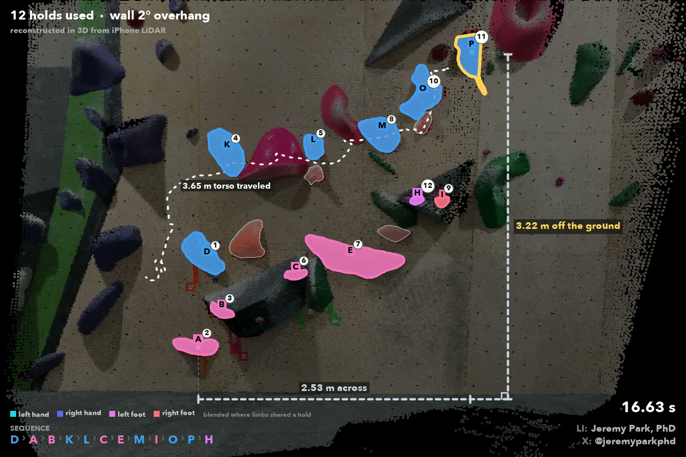

# rock_climbing_3d

The [`rock_climbing`](../rock_climbing/) demo, in three dimensions and in meters.

This version reads a climb from a video recorded **with depth**, so the wall,
the holds and the climber are placed in 3D, and distances like the height of
the route are measured in meters.

It uses two models on the [VLM Run Gateway](https://www.vlm.run/gateway):
[`sam3.1`](https://docs.vlm.run/gateway/models/facebook-sam3.1) to track the
holds and
[`vitpose-plus-large`](https://docs.vlm.run/gateway/models/usyd-community-vitpose-plus-large)
for the climber's pose. The 3D work runs locally.

<p align="center">
  <a href="https://www.youtube.com/watch?v=vjItC11jF0o"></a>
  <br>
  <a href="https://www.youtube.com/watch?v=vjItC11jF0o">▶ Watch on YouTube</a>
</p>

For a regular video without depth, use [`rock_climbing`](../rock_climbing/).

## The data

I captured the video and LiDAR depth with a local iPhone app on my iPhone 15
Pro. Details about the data capture and the app can be shared upon request.

Each capture is a folder with the video, a depth map for every frame, and the
camera's calibration.

In theory, it should work with other depth sensors (e.g. a RealSense).

## Run it

1. Get an API key at [VLM Run](https://app.vlm.run/sign-in) and add it to a
   `.env` at the vision-demos root:

   ```bash
   cp ../.env.example ../.env
   ```

   Then paste the key after `VLMRUN_API_KEY=`.

2. Create the conda environment:

   ```bash
   conda env create -f environment.yml
   conda activate rock_climbing_3d
   ```

3. Put your capture folders in `data/input/current/`.
4. Set `HOLD_COLOR` in [`config.py`](config.py) to match your route.
5. Run `python main.py`.
6. The output is in the newest folder under `data/output/`. The video ends in
   `_climb.mp4`.

## How it works

1. **The wall.** The depth maps are fused into one 3D point cloud, with the
   camera's path solved frame by frame.
2. **The holds.** SAM 3.1 tracks the route's holds through the video, and
   each one is placed in 3D from the depth under it.
3. **Which way is up.** The floor is found in the point cloud, which gives
   gravity and the wall's angle.
4. **The climber.** ViTPose finds the climber's pose in every frame, and each
   joint is placed in 3D from the depth.
5. **The climb.** A hand or foot touching a hold in the image only counts if
   it is also physically close enough in 3D. The clock starts when both feet
   leave the floor and stops when both hands are on the top hold.

Every setting is in [`config.py`](config.py), with an explanation beside it.
The detailed rules, and what to change when something looks wrong, are in
[route-reading-explained.md](route-reading-explained.md).

<p align="center">
  
  <br>
  <em>Final visualization showing the holds used and the real-world distances in meters.</em>
</p>

## Output

Each run writes to a timestamped folder under `data/output/`:

* `<capture>_climb.mp4`: the video and the 3D route, side by side
* `<capture>_route.mp4`: the 3D route on its own
* `route3d.png`: the route on the wall, face-on
* `wall.ply`: the 3D wall with the route on it (opens in MeshLab or Blender)
* `climb.json`, `sequence.json`, `summary.txt`: the holds used, their order,
  and the timing

## License

[Apache-2.0](../LICENSE).
